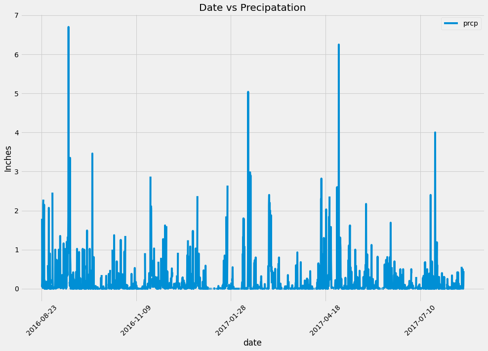
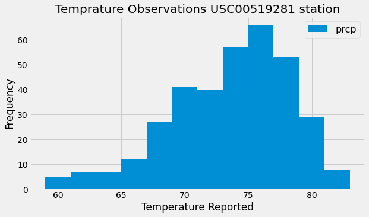
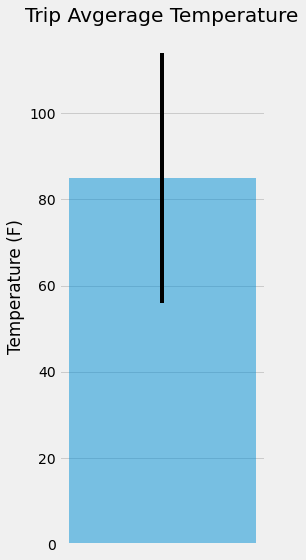
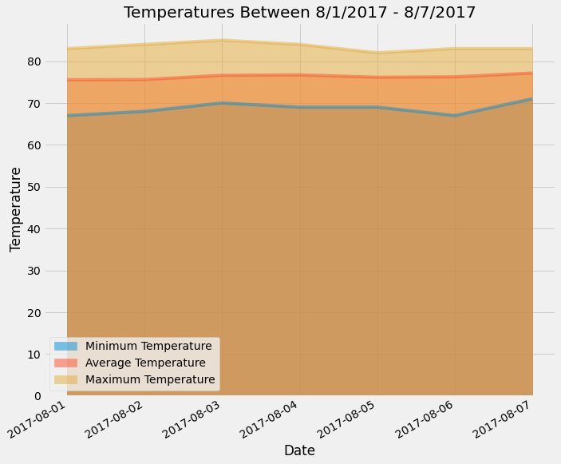

# SQLAlchemy Homework - Surfs Up!

## Step 1 - Climate Analysis and Exploration

Python and SQLAlchemy were used to do basic climate analysis and data exploration of the Hawaiian climate database. All of the following analysis was completed using SQLAlchemy ORM queries, Pandas, and Matplotlib.

* The [starter notebook](climate_starter.ipynb) and [hawaii.sqlite](Resources/hawaii.sqlite) files were provided to complete the climate analysis and data exploration.

* SQLAlchemy `create_engine` was used to connect to the sqlite database.

* SQLAlchemy `automap_base()` was used to reflect tables into classes and save a reference to those classes called `Station` and `Measurement`.

* Python was linked to the database by creating an SQLAlchemy session.

* **Important** Don't forget to close out your session at the end of your notebook.

### Precipitation Analysis

* I retrieve the last 12 months of precipitation data by querying the 12 preceding months of data. **Note** you do not pass in the date as a variable to your query.

* The `date` and `prcp` values were selected.

* The query results into a Pandas DataFrame and set the index was set to the date column.

* DataFrame values was sorted by `date`.

* DataFrame `plot` method was used.

  

* Pandas was used to print the summary statistics for the precipitation data.

### Station Analysis

* A query was designed to calculate the total number of stations in the dataset, 

* a query was designed to find the most active stations (i.e. which stations have the most rows?).

  * The stations and observation counts were listed in descending order.

  * The station with the highest number of observations was found.

  * Using the most active station id, the lowest, highest, and average temperature was calculated.

* A query was designed to retrieve the last 12 months of temperature observation data (TOBS).

    

* Close out your session.

- - -

## Step 2 - Climate App

Now that you have completed your initial analysis, design a Flask API based on the queries that you have just developed.

* Use Flask to create your routes.

### Temperature Analysis I

* Hawaii is reputed to enjoy mild weather all year. Is there a meaningful difference between the temperature in, for example, June and December?

* We used pandas to find the temperature difference between June and December.

### Temperature Analysis II

* Using the historical data in the dataset to find out what the temperature has previously looked like between August first to August seventh.

    

### Daily Rainfall Average

* The rainfall per weather station was calculated using the previous year's matching dates.

  * The data was sorteded in descending order by precipitation amount and list the station, name, latitude, longitude, and elevation.

  

* Close out your session.

